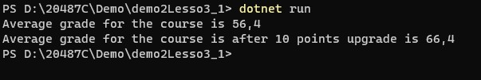

# Module 2: Querying and Manipulating Data Using Entity Framework

# Lesson 3: Querying Data

### Demonstration 2: Running Stored Procedures with Entity Framework

- Abrir el proyecto de consola StoredProcedure en Visual Studio Code 
- Analizamos el proyecto
- Ejecutar

